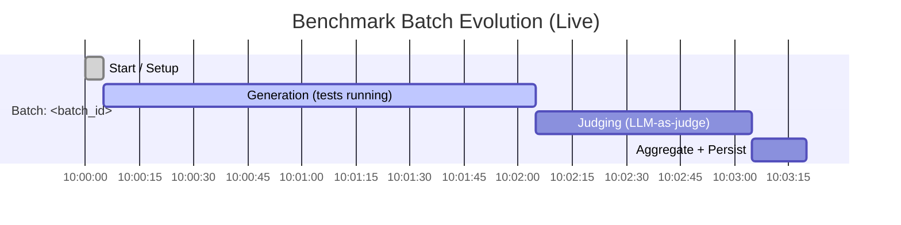
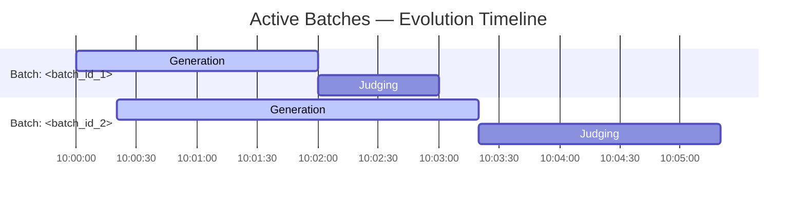
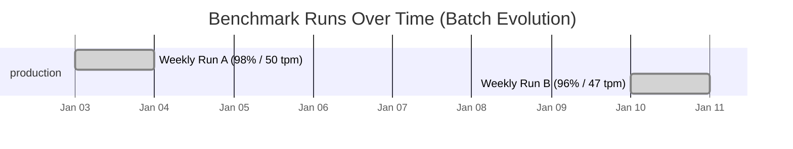

# Cheeky Zooming Popcorn — Plan

## Benchmark (Real-Time Batch Evolution Timeline)

### Goal
Track benchmark *batch evolution* as it happens (generation → judging → aggregation), with an at-a-glance “Gantt-style” view plus the few key numbers you actually need while it’s running.

### Live Data Sources (AgentX)
- **Live progress across running batches:** `GET /api/benchmark/active-stats` (poll every 2–5s)
- **Final metrics + results for a batch:** `GET /api/benchmark/batch/:id`
- **Historical regression/trajectory:** `GET /api/benchmark/trends`
- **Side-by-side comparison:** `POST /api/benchmark/compare-batches`

### Real-Time Gantt (Forecast + Actual)
Mermaid Gantt is the most compact “good looking” timeline that renders well in Markdown viewers.

**How it works:**
1. While running, render a **forecast timeline** from `elapsed_ms` + `eta_ms` (from `active-stats`).
2. When complete, replace forecast with an **actual timeline** using `execution_metrics.*_duration_ms` (from `batch/:id`).

#### Mermaid Template (single batch)
Replace the timestamps + durations with values derived from API responses.

#### Mermaid Template (multiple concurrent batches)
Use one section per batch. Keep it to ~3–5 active batches to stay readable.

### “What’s changing right now?” (Live KPI Strip)
When watching a run, these are the minimum metrics that make the timeline actionable:

| Batch | Status | Progress | Judge | Elapsed | ETA | Running | Completed | Pending |
|------:|--------|---------:|------:|--------:|----:|--------:|----------:|--------:|
| `<id>` | running | 30% | 25% | 120s | 180s | 150 | 45 | 105 |

Populate this table directly from `GET /api/benchmark/active-stats`.

### Batch Evolution Across Runs (Regression Timeline)
To follow “batch evolution” over days/weeks (not just within a single run), render a second Gantt where each bar is a completed batch (duration = `total_duration_ms`, label includes `success_rate`, `tests_per_minute`, `avg_quality`, `avg_composite`).

### Update Loop (simple + reliable)
- Poll `GET /api/benchmark/active-stats` every 2–5 seconds.
- For each active batch row:
  - Show `progress`, `judge_progress`, `elapsed_ms`, `eta_ms`, and counts.
  - Render/refresh the **forecast** Gantt bars.
- When a batch disappears from `active-stats` (or reaches 100%):
  - Fetch `GET /api/benchmark/batch/:id` once.
  - Replace forecast with **actual** phase durations from `execution_metrics`.

### Notes (to keep it readable)
- Don’t try to show every prompt/test on the Gantt; keep it at phase-level.
- If you need more detail, link out to the batch detail view (`/api/benchmark/batch/:id`) and keep the timeline as the “status board”.
