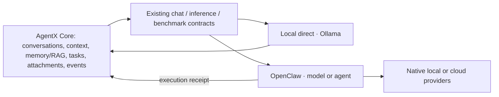

# Execution sources

AgentX selects an execution source and a mode. Model origin and billing are
separate facts published by that source.

| Source | Mode | Execution owner |
| --- | --- | --- |
| Local direct | Model | Existing Ollama inference, routing, host admission and claims |
| OpenClaw | Model | Native provider SDK, supplied context, one model invocation |
| OpenClaw | Agent | Native agent profile, tools, memory and fallback policy |

The local contract names its engine. Ollama is implemented; selecting an
uninstalled engine fails explicitly. Another local engine can extend that
boundary without becoming an AgentX cloud adapter.



## Selection and ownership

`execution: { source: "openclaw", mode: "model", model: "provider/model" }`
selects a native model. `mode: "agent", agentId: "configured-agent"` selects a
native agent. The Playground uses equivalent opaque model identifiers
`openclaw:model:provider/model` and `openclaw:agent:configured-agent` in the
existing picker. Explicit OpenClaw selection excludes automatic local routing
and cross-model fallback in AgentX. An uncertain turn is never replayed through
the other source.

Core assembles and persists conversation context. Model mode does not add an
OpenClaw persona, session history, memory or tool execution. Core-provided RAG
and conversation history remain explicit input. Agent mode runs the native
profile. In Playground agent mode, the completed answer is delivered once; native
progress may be rewritten, so this path does not promise stable token deltas,
thinking or tool receipts. Its usage and cost remain unknown when the native
Responses API does not provide them. Existing Household native sessions and tool receipts retain their
dedicated conversation transport.

Core's reverse OpenClaw local bridge stays local. It cannot delegate an
OpenClaw selection back to OpenClaw. Embeddings keep their local inference
contract.

Provider credentials, endpoint configuration, model aliases, fixed provider
routing and prices live in OpenClaw. AgentX holds its existing gateway service
credential (`OPENCLAW_GATEWAY_URL`, `OPENCLAW_GATEWAY_TOKEN`). It reads a native
catalogue; it does not query provider catalogues or accept provider credentials
in campaign transport files.

## Native model execution

`integrations/openclaw/model-execution` is installed as an OpenClaw plugin.
Its authenticated routes are `GET /api/agentx/execution/models` and
`POST /api/agentx/execution/model`. Provider transports come from OpenClaw's
model registry and LLM SDK. The plugin does not implement a provider client.

The catalogue distinguishes local, included subscription, declared free, paid
and unknown billing. Zero prices alone do not prove free cloud usage: a native
`:free` alias or an explicit native model `params.billingKind: "free"` declaration
is required. Native model metadata can similarly declare included usage.
An included subscription means marginal included usage;
it does not price the subscription itself. Unknown cloud pricing blocks model
execution. Paid execution needs a native `maxRequestCostNanodollars` ceiling;
the default is zero. A narrower request or benchmark grant ceiling also applies.
The reservation conservatively prices the native context window and output
limit. Paid campaign admission uses the same bound before allowing a call. It is an estimate from the native catalogue, not an invoice guarantee.
Provider-account spending limits remain configured with OpenClaw and the provider.

An instance that wants no per-request ceiling sets `maxRequestCostNanodollars`
to the largest safe integer; the reservation is still computed and recorded.
The plugin keeps a running total of dispatched paid model-mode calls in
`paid-spend.json` under its OpenClaw state directory and publishes it as
`spend` in the catalogue: paid calls, estimated nanodollars, and the number of
calls whose cost was not observed (a dispatched call that failed is counted
there, never priced). A paid call is refused before dispatch when that total
cannot be read. Core raises the `openclaw-paid-spend-step` alert each time the
total crosses another 10 USD. The total is a runtime estimate from native
catalogue rates, not an invoice, and it does not include native agent runs.

Model mode streams text and thinking and propagates cancellation. It accepts
only bounded generation parameters and refuses requested parameters that are
absent from the final native payload. No agent session, delivery, fan-out or
tool executor runs. Protocol fixtures may supply tool schemas and receive tool
calls; those receipts state that schemas were supplied and zero tools executed.
The first model API accepts text context. Image content and replayed tool messages
require an explicit contract extension; the existing local and Household paths retain
their attachment contracts.

Model-only admission is a table of runtime version and native API. On OpenClaw
2026.9.4 it qualifies `openai-completions`, `anthropic-messages` and
`openai-responses`. A different runtime version is unavailable in model mode
until its transports are qualified and the table is updated. For each qualified
API an installed-SDK test proves one HTTP attempt on success, 429, 503, a refused
connection, a broken stream and a cancellation, with the partial answer kept.
The plugin compares the final payload with the submitted context on each call,
and refuses provider-held state, server-side model fallback and any prompt the
SDK adds, such as the agent identity sent with an Anthropic subscription token.

| Native API | Applied | Refused before dispatch |
| --- | --- | --- |
| `openai-completions` | output limit, temperature, seed, topP, JSON, thinking | numeric reasoning budget when unapplied |
| `anthropic-messages` | output limit, thinking on/off and level, temperature where the model accepts it | seed, topP, JSON, numeric reasoning budget |
| `openai-responses` | output limit, thinking on/off and level, temperature where the model accepts it | seed, topP, JSON, numeric reasoning budget |

A target without JSON and seed cannot be a judge. `openai-chatgpt-responses`
(subscription) stays unavailable in model mode: its native payload carries no
output limit, so the requested bound cannot be applied. The Google SDK defaults
to five attempts and has no configured provider to qualify. Configured native
agents on these APIs remain accessible. This is a runtime capability gate, with
no AgentX provider client.

The SDK parameter wrapper is currently an internal generic OpenClaw function.
The loader checks its named export and records its file fingerprint. Missing
or changed runtime/catalogue pins require qualification; no provider-specific
AgentX fallback replaces the native SDK.

## Receipts and benchmark meaning

Conversations retain the native execution receipt. Benchmark model execution
adapts it to the existing WorkerEnvelope/WorkerReceipt boundary, including
context and payload fingerprints, isolation evidence, cache tokens and the
native receipt fingerprint. Agent CLI execution cannot claim `isolated_model`,
even when its observed tool count is zero. Agent targets cannot judge isolated
models. Raw targets publish judge eligibility only after the native JSON format
and the existing judge seed contract are supported. The qualified
2026.9.4 completions transport forwards both through the native parameter wrapper.
All native agent Benchmark targets stay unavailable until cell-wide turn, tool,
token and spend limits are qualified before each native call; model mode has a
single invocation ceiling. The [broker installation procedure](../integrations/benchmark-harness-broker/README.md#instance-configuration)
describes the required catalogue refresh order. Historical agent receipts retain
their existing ranking rules below; this gate prevents new native agent cells.

A native agent ranks on the same leaderboard as bare models. The campaign kind
does not split the quality cohort: results share one when scorer, judge and
generation settings match. The execution identity stays distinct. An agent is
its own entry (`harness:<harness>:<target id>` as its host), labelled as an
agent with its context window and tool count, so two agents on one model, or an
agent and the bare model behind it, never share a row. Its context and tools are
part of what is measured, not a comparability defect. An agent row is rankable
on a complete `native-ceiling` worker receipt, a bare harness model on a
`portable` one; the other exclusions (truncation, infrastructure failure,
executable verification) apply to both.

SDK identity proves the native selected route and requested model alias. It
does not observe the served model revision or the upstream provider behind a
router. New receipts use `modelVersion: "unknown"` and record that limitation.
SDK costs are runtime estimates; they are not labelled provider-reported.
The SDK's empty zero-usage defaults cannot become successful measured results.
Frozen model profiles include their observation window so unobserved revisions
are not silently combined across catalogue refreshes.
Missing conversation cost or usage remains unknown, including aggregate cost.

For OpenRouter isolated benchmarks, the native model profile must already pin
one upstream route and disable provider routing fallback. Otherwise the target
is unavailable for model benchmarking. The result still does not claim an
independently observed upstream identity. The former direct executor's exact
generation metadata and reported invoice cost are unavailable through this SDK.

The qualified 2026.9.4 direct completions transport drops `seed` and `topP`
and its simple options omit JSON format. The plugin forwards these bounded
parameters through OpenClaw's existing generic extra-body wrapper and verifies
the final payload before HTTP dispatch. An installed-SDK test proves all three
parameters and one HTTP attempt without opening a provider socket. New portable campaign
contracts at version `1.1.0` can declare `seed: null` to request native defaults;
version `1.0.0` retains its historical null-to-zero normalization. This differs
from a seeded historical campaign. Numeric reasoning budgets are also refused
when the SDK fails to apply them. Agent request overrides are refused because
the native Responses endpoint does not attest their application; set them in
the native agent profile. Options are a qualified OpenClaw update or a native
SDK improvement, followed by the same transport tests.

## Migration and validation

1. Install and qualify the native plugin using the accepted OpenClaw package.
   Validate catalogue visibility, billing, fixed routing, bounded spend,
   streaming, cancellation and actual parameter application. No LLM campaign is
   required for the synthetic checks.
2. Adopt source selection in Core and the Playground. Existing local requests,
   host admission, local embeddings and Household agent continuity must pass.
3. Project native models into the existing benchmark catalogue with
   `materialize-openclaw-model-catalog.js /private/new-catalog.json
   /private/existing-catalog.json`. The optional existing catalogue preserves
   local targets and native agent profiles. Local native model benchmarking is
   withheld until Core claim propagation is qualified; existing claimed local
   executors remain usable. Expired cloud entries in a mixed catalogue do not
   disable freshly observed local pins.
4. Retire the direct provider client and remove its Core/Broker credential
   injection. Recreate executable pins before activation. Keep former catalogue
   snapshots, commits, raw results, WorkerReceipts, cohorts and provenance outside
   Git. No database migration rewrites historical scores or identities.

The removed implementation is the OpenRouter isolated executor, its Qwen-specific
materializer and isolated profile, and the campaign OpenAI-compatible/OpenRouter
transports. The local Ollama transport, native agent executor, generic broker,
price accounting, provider telemetry and historical error categories remain.
Historical local trials may be stored outside Benchmark; database absence is
not evidence that a trial never occurred.

Relevant checks:

```bash
npm test --prefix integrations/benchmark-harness-broker
npm test --prefix integrations/openclaw/model-execution
npm run build --prefix core
```

The installed-SDK test runs when OpenClaw is available next to the plugin and
injects the native network port. Other synthetic tests require no OpenClaw
installation. Egress tests permit only the configured gateway from AgentX;
provider HTTP construction is confined to the native SDK inside OpenClaw.
Deployment acceptance additionally checks container credential names and
observed Core/Benchmark/Broker destinations. Do not merge synthetic tests with
live model qualification or claim deployment from a successful source build.
