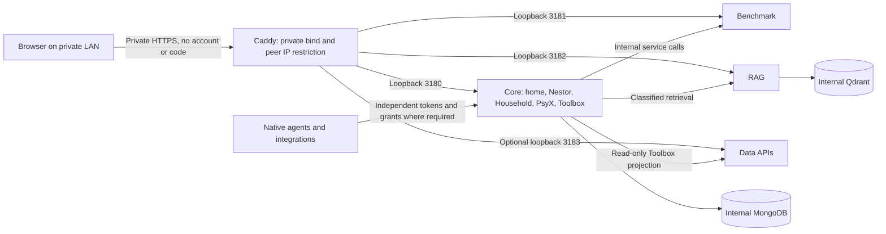

# Private LAN human access

Human interfaces and APIs are accessible without an account, adult code or
unlock session on the private LAN. This is a deliberate deployment model:
anyone who can reach an application entry can use its human capabilities,
including personal data and review controls. The server does not identify an
owner, parent or child. Opening Famille does not lock other pages or tabs.

The former filename is retained so documentation links remain valid. Code and
face unlocking are retired. [Scope inventory](LAN_ACCESS_SCOPE.md) describes
the removed paths; [voice identification](VOICE_ID.md) is a future design only.

## Current access architecture

Use `config/household.Caddyfile.example` for complete Core, Benchmark, RAG and
optional Data entries, including all assets and API paths. Replace the example
LAN bind address and local DNS name. The example uses the private Caddy CA;
install/trust that CA on intended devices or preserve the installation's
existing trusted TLS configuration. Never disable certificate verification.
The example disables automatic HTTP redirects to avoid adding a wildcard port 80
listener. Merge this option with the active global options; preserve any existing
explicit private redirect separately. The gateway checks its actual peer address; client-supplied forwarding headers
are not identity or permission. Application published ports remain on loopback;
MongoDB/Qdrant remain internal. No WAN listener, NAT/UPnP mapping, public tunnel
or Internet entry belongs to this model. A publicly resolvable hostname alone
neither authorizes nor proves Internet exposure.

Core serves `/`, `/dad`, `/panel`, `/psyx` and `/data-toolbox` directly in the
full profile. Benchmark and RAG retain their separate LAN HTTPS origins. Data
has its own API service; the Toolbox retains its bounded projection, its existing device naming/known-state
controls, the MQTT publish form and the storage scan request. The demo profile continues to exclude personal and household
capabilities, regardless of the browser entry.

## Capability and identity boundaries

| Capability | Authority that remains |
|---|---|
| Conversation history, attachments and memory | Core server-bound surface, pack, owner namespace and memory audience; browser-supplied scope cannot rewrite an existing conversation |
| Famille | Tool-free family agent, bounded household context and explicitly approved household/normal retrieval; no Main private tools |
| Personal and engineering tasks | Core lane rules; private/family tasks remain excluded from worker selection and planning context |
| Family review | Explicit check-in → review → approval/reopen/cancel and transition receipts; no authenticated human identity |
| PsyX | `surface:psyx:default` conversation owner, longitudinal state and explicit reset/delete confirmation; no automatic RAG publication |
| Benchmark | Admission, claims/leases, execution limits, judge qualifications and receipts |
| RAG | Classification, ingestion roots, source retirement and destructive confirmations |
| Data | Preview, evidence, confirmations and bounded approved file mutations at its own service |
| Native consumers | Existing dedicated consumer tokens, tool grants, chair token and signed integration launch permissions |

A page or persona chooses behavior and a bounded server capability; it is not
proof of a person's identity. Human LAN access intentionally permits reaching
personal management routes. Famille handlers themselves stay scoped even
though a LAN user can deliberately navigate to Nestor.

Legacy source names such as `household-parent` in receipts indicate the review
surface. `actor.declared` is a declaration, `actor.authenticated` remains null.
An approval records the decision and workflow evidence, not that a parent was
present. Guardian-consent checkboxes in the opt-in audio vault are likewise
human declarations; they are not verified identity. Existing receipt data is
not rewritten. Real children's voice use requires a separate explicit decision.

`PSYX_ACCESS_TOKEN` remains an independent native bearer credential. Core
human requests without Authorization use LAN access; explicitly supplied invalid
credentials are refused. Native-only embeddings may select token mode through
`PSYX_ACCESS_MODE`; the built-in Core human surface always uses LAN access.
There is no cookie exchange, expiry timer or human token entry page. External
consumer, OpenClaw, roundtable, DSH Studio and other independent grants remain.
DSH Studio's own signed launch cookie and forward-auth route must not be removed.

## Bookmark and cookie migration

`GET /unlock`, `/access/code` and `/access/face` redirect to `/dad`, or to a
validated `next` path/explicitly configured service origin. External origins,
credential-bearing URLs, invalid encoding, control characters and recursive
retired destinations fall back to `/dad`. The redirect never requires a code.

All `/api/access/*` routes and PsyX `/api/psyx/auth/*` routes are gone and return
404. The deleted `access-assets` files are not served. Old `agentx_adult` and
`psyx_session` cookies are ignored and expired when presented to Core. Independent
integration cookies remain intact. Fresh human requests create no adult cookie.
Old pages cached in already-open tabs may still run old scripts: reload every
human tab once the coordinated update is complete.

## Coordinated gateway and code migration

Live inspection, SSH, production reload/restart and deployment require owner
approval after reviewing the local commits. Do not infer production state from
this example or from local test results.

1. Reconcile the two repository commits with concurrent work. Prepare the new
   image, exact private env patch and a reviewed diff of the **active** full
   Caddy configuration. Preserve unrelated sites, TLS trust, native integration
   gates and secrets. Back up the previous image/revisions, env and gateway
   configuration outside Git; preserve database/volume content.
2. Before activation, record backend loopback bindings, actual Caddy listeners,
   router NAT/firewall, IPv4 and IPv6 reachability and any tunnels. Add the LAN
   peer restriction to every application entry without opening another listener.
   Validate the whole candidate with `caddy validate --config <candidate>`.
3. In one approved deployment window, remove only the adult forward-auth checks
   to `/api/access/authorize` **before** switching Core to a revision without
   that route. Retain any old entry marker temporarily while old Core still
   runs. Existing Core unlock behavior lasts until its switch; service entries
   now follow the chosen LAN model. Reload Caddy and check service pages/APIs.
4. Apply the reviewed env/Compose patch and activate the new Core image. Remove
   the obsolete entry marker from the final gateway config. Check `/`, `/dad`,
   `/panel` → `/dad`, `/psyx`, Benchmark, RAG and Toolbox/Data, both HTML and API.
   Verify absent code routes (404), no unlock redirects/cookies and unchanged
   native token refusals and domain confirmations. Reload browser tabs.
5. Check listener/firewall/router/tunnel state again, including IPv6. From an
   approved device outside the LAN verify no application entry is reachable;
   a LAN curl alone cannot establish that. Record the actual served revisions,
   TLS result, commands and outputs in a private deployment receipt.

Rollback in the same bounded window if access or domain checks fail: restore
**old Core/image/env first**, then the old Caddy forward-auth configuration.
Restoring old forward auth while new Core has no authorization route would
block service entries. Keep the old required secret available until rollback
is retired. Bookmark migration and cookie expiry do not change stored business
data; old adult browser sessions will need a fresh unlock after rollback.

## Separate retirement of facial/code data

No deletion or production inspection is performed by this refactor. The old
`access_face_enrollments` collection stored subject `default` and descriptor
arrays, not camera frames. `access_parental_code` holds the locally set hash/salt.
The live count is unknown; environment/file-based codes may also remain on-host.

After **separate explicit approval**:

1. Confirm the database/instance identity and counts without printing descriptors,
   hashes or credentials. Inventory host-only legacy code files, env settings
   and relevant encrypted backup generations. Do not infer enrollment from
   archived descriptions.
2. Export the exact retired collections to a restricted, encrypted, out-of-Git
   backup with a recorded hash and deletion/retention decision. Check restore
   in a disposable database before removing the live copies.
3. With the owner-approved database selected, execute only
   `db.getCollection('access_face_enrollments').deleteMany({})`; separately
   approve `db.getCollection('access_parental_code').deleteMany({})` and obsolete
   host-only code/env cleanup. Do not drop a database, delete PsyX state or
   touch the audio evidence vault.
4. Verify zero documents in each approved collection and normal human journeys.
   Record counts and deletion receipts only. Decide backup expiry separately;
   live deletion does not erase old backup generations. Restore only from the
   approved encrypted backup if this data-specific operation needs rollback.

## Local verification

`npm run test:prepare`, `npm test`, `npm run test:surfaces --prefix core`,
`npm run test:shared`, `npm run build` and `npm run check:compose` are the normal
checks. `CADDY_BIN=/path/to/caddy npm run test:gateway` additionally runs a real
local HTTPS Caddy proxy in front of the actual four application entry points,
using a temporary trusted CA and disposable Mongo. Without `CADDY_BIN`, that
optional integration test is explicitly skipped in Core's general suite.
Its route tests exercise real API validation/confirmation failures, without
running real inference, janitor actions or production scans. A successful local
proxy result is not acceptance of the deployed gateway or household devices.
