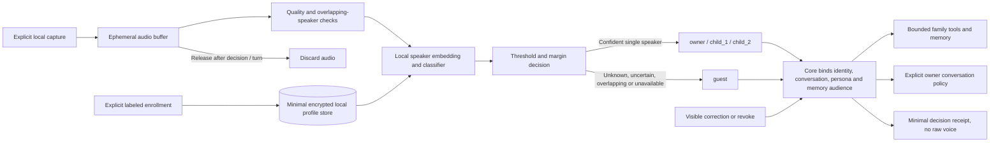

# Local voice identification — proposed architecture

**Voice ID is not delivered.** This document is the next capability design;
there is no classifier, implicit enrollment, voice collection or new identity
permission in the LAN-access refactor. No PIN, facial recognition or account is
planned as a replacement for the retired adult code.

The accepted threat model permits recorded or synthesized voice spoofing in a
private home. Voice classification suggests an identity with measured uncertainty;
it is not cryptographic identity or proof of guardian presence. Human LAN APIs
remain directly accessible until an explicit later product decision changes them.

## Target path

Core owns identity binding and conversation policy. A local voice adapter performs
capture/quality/classification and emits bounded evidence; VoiX or another harness
may implement that adapter without becoming memory or business authority. Private
instance configuration owns devices, enrollment, thresholds, keys and retention.
Generic contracts and tests belong to AgentX. No cloud enrollment upload is needed.

## Profiles and explicit enrollment

| Profile | Enrollment and default scope |
|---|---|
| `owner` | Explicit owner-labeled local session; a measured identity hint may suggest a personal conversation under reviewed policy |
| `child_1` | Separate, explicitly approved and labeled session; family scope and child-safe persona |
| `child_2` | Separate, explicitly approved and labeled session; family scope and child-safe persona |
| `guest` | Explicitly supported unknown/visitor profile, with no personal memory; no pooled collection of visitors' voices |

The enrollment UI must name the intended profile and state exactly what will be
retained before recording begins. The owner explicitly declares guardian approval
for child enrollment; the server does not claim to verify parent identity. Capture
a few separate utterances on intended devices, inspect quality locally and require
an explicit save. Never label old transcriptions, family journals, TTS voice-clone
sources or opt-in audio-vault clips as enrollment automatically. An enrollment
category in that existing vault is evidence storage, not an installed identity model.

`guest` is a first-class profile with zero biometric enrollment by default. It
covers unknown and ambiguous speakers rather than learning an average visitor.
All four profiles must be explicitly configured; recording children is optional
until separately authorized and their absent profiles always resolve to guest.

Keep only a versioned aggregate speaker embedding or the minimum per-device
embedding set shown necessary by evaluation, opaque profile ID, explicit approval
record, model/version, capture device class, quality result and enrollment/revocation
timestamps. Store encryption keys separately from encrypted templates. Do not retain
raw audio by default, transcripts, children's names, ages, inferred emotions or
unrelated background speech. Any temporary enrollment audio has a visible expiry
and is deleted after save/cancel; debugging audio retention requires a separate
explicit opt-in. The private home may map opaque labels to display names locally.

## Decision and uncertainty

Use a speaker-verification score, minimum signal/utterance quality, calibrated
acceptance threshold and minimum margin over the second-best enrolled profile.
Do not adopt an unmeasured universal numeric threshold: calibration is model,
device and room dependent. Store the accepted threshold set/version externally.
Insufficient speech, noise, close scores, out-of-distribution voices, revoked
profiles, model failure and overlapping speakers produce `guest`.

Separate wake-word detection, transcription, speaker identity, persona and memory
policy. A recognized wake word or voice used for synthesis identifies none of them.
Never infer `owner` from a topic, transcript, UI persona or device name. Do not create
a new enrollment or update an existing template during ordinary conversation.

The UI shows the current profile and a simple correction control. A correction
applies to the next turn or starts a new scoped conversation after stopping the
current response. It records a user declaration and does not silently retrain the
classifier. If a mistaken owner decision already exposed personal content, stop
playback, clear pending private retrieval/tool work and start a fresh guest/family
context; record the exposure category without copying the sensitive content.
Correction cannot undo content already heard.

## Conversations, personas and memory

Bind a classification receipt to the **exact** conversation and turn before
retrieval or tool admission: profile, confidence bucket, model/threshold version,
quality/ambiguity reason and whether manually corrected. Keep no voice sample in
the receipt and no cross-conversation identity assertion based on a stale result.
Re-evaluate on new utterances and device/session changes, with an explicit bounded
validity period established by measured behavior.

A policy table maps a known child or guest to existing family/child memory audiences
and tool limits. Owner may suggest personal Nestor, with a visible transition and a
new/explicitly selected personal session; changing the persona alone never widens
audience or imports Main tools into Famille. Keep personal, family and engineering
task lanes separate. Existing conversations cannot acquire a different owner or
memory scope from an untrusted browser parameter or late classifier response.
Uncertain identity never merges memory across profiles. Save durable memories only
through the existing reviewed Core capability.

When multiple people speak, use guest for overlap and do not attribute the transcript
to the loudest person. Non-overlapping turns may be classified individually only if
quality and speaker separation pass. A new child/guest speaker during an owner turn
stops personal context handoff and asks for one speaker at a time; do not reveal
private content while resolving the ambiguity. The UX must remain usable without
classification: family/guest conversation and explicit manual correction still work.

## Revocation and deletion

Provide a visible list of enrolled opaque profiles and a revoke/delete action.
Revocation invalidates cached decisions immediately, releases active audio buffers
and resets subsequent turns to guest. Delete the template, model-derived caches
and profile-specific calibration artifacts; detach identity bindings from future
reads without erasing conversation business data implicitly. Re-enrollment is a
new explicit action with a new enrollment version. Explain encrypted backup expiry
and keep a minimal deletion receipt without embeddings. No facial data is migrated
into the voice profile store.

## Evidence before release

Use synthetic/consenting-adult fixtures first. Real-device and child testing requires
separate owner approval and cannot be inferred from this document. Evaluate every
actual phone/tablet/PC microphone in quiet, household noise, at distance, after TTS
playback, in short/long turns and with multiple speakers. Include unregistered and
similar voices, replay/synthetic samples, device changes, interruption, stale results,
manual corrections, revocation and unavailable classifier behavior.

Report owner false acceptance separately from missed owner recognition, child/child
confusion, unknown-to-guest rate, overlap abstention, decision latency and raw-audio
lifetime. Demonstrate that child/guest never receives private retrieval or Main tools
through the policy adapter, and that changing identity does not contaminate an
existing conversation. Declare coverage gaps and measure enough independent sessions
to justify confidence bounds; a few successful clips cannot qualify a threshold.

Release stages: reviewed schema and policy adapter; explicitly approved local
profiles; guest-only shadow decisions with no memory widening; device/noise
qualification; then a separately approved identity-guided experience. Keep a switch
to disable classification and discard transient audio immediately. The current
private LAN model remains the fallback, with its known lack of human authentication.
